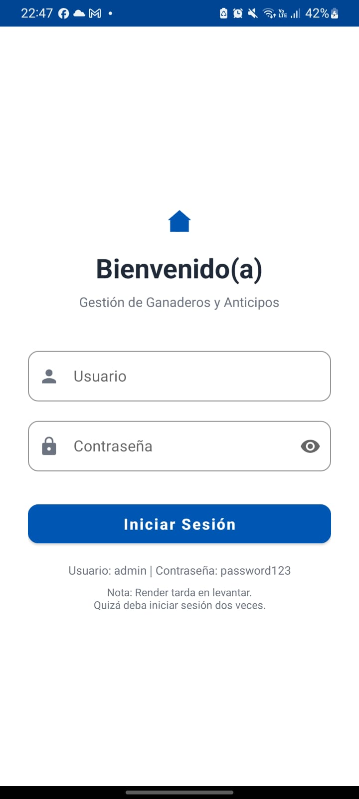
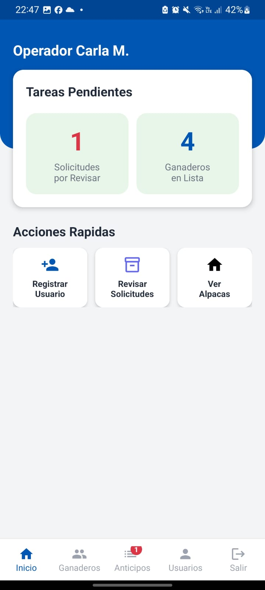
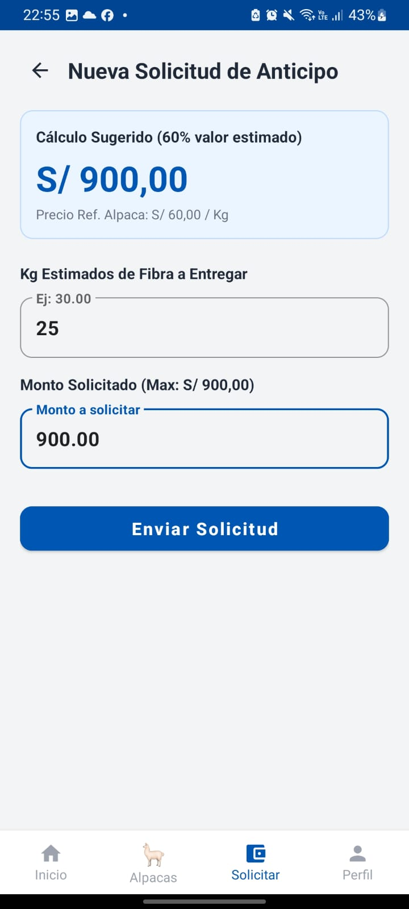
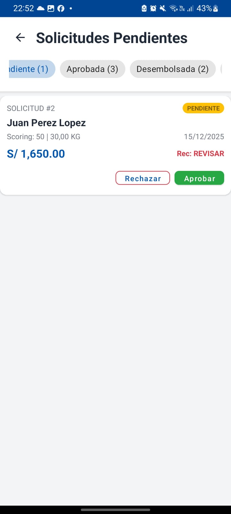

# Sistema de Gestión de Anticipos - Ganaderos de Alpacas

**Alumno:** Kendell Norabuena  
**Docente:** José de Jesús Alzati Zárate

---

## Descripción

Aplicación móvil Android para facilitar el acceso a financiamiento a ganaderos de alpacas en comunidades rurales, permitiendo solicitar anticipos basados en su producción de fibra.

## Problema

- Falta de acceso a servicios financieros en zonas rurales
- Procesos manuales lentos para gestión de anticipos
- Falta de transparencia en cálculos financieros

## Funcionalidades

- **Autenticación** - Login de usuarios y administradores
- **Gestión de Alpacas** - CRUD de alpacas por ganadero
- **Gestión de Usuarios** - Registro y administración
- **Solicitudes de Anticipo** - Crear y dar seguimiento
- **Dashboard** - Resumen para administradores

---

## Capturas de Pantalla

|           Login           |           Inicio            |      Solicitud de Anticipo      |
| :-----------------------: | :-------------------------: | :-----------------------------: |
|  |  |  |

|               Listado de Ganaderos               |              Registro de Alpacas              |              Solicitudes              |
| :----------------------------------------------: | :-------------------------------------------: | :-----------------------------------: |
|  |  |  |

|              Gestión de Usuarios               |              Solicitud Usuario              |
| :--------------------------------------------: | :-----------------------------------------: |
|  |  |

---

## Tecnologías y Componentes

### Lenguaje y SDK

- **Kotlin** - Lenguaje principal
- **Android SDK** - API 24+ (Android 7.0)
- **Gradle Kotlin DSL** - Sistema de build

### Arquitectura

- **MVVM** (Model-View-ViewModel)
- **Clean Architecture** - Separación en capas (data, domain, presentation, ui)
- **Repository Pattern** - Abstracción de fuentes de datos

### Componentes de UI (Android)

- `AppCompatActivity`
- `RecyclerView` + `ListAdapter`
- `ConstraintLayout`
- `MaterialToolbar`
- `FloatingActionButton`
- `TextInputLayout` + `TextInputEditText`
- `CardView`
- `ProgressBar`
- `AlertDialog`
- `Toast`
- `Spinner`

### Patrones y Utilidades

- **Coroutines** - Programación asíncrona
- **Sealed Classes** - Estados UI (Loading, Success, Error)
- **Result** - Manejo de respuestas
- **Extension Functions** - Funciones de extensión
- **Data Classes** - DTOs y modelos

---

## Estructura del Proyecto

```
app/src/main/java/com/alpaca/knm/
├── data/
│   ├── local/
│   ├── remote/         # Retrofit, APIs, DTOs
│   ├── repository/     # Implementaciones de repositorios
│   └── sync/
├── di/                 # Inyección de dependencias
├── domain/
│   ├── model/          # Modelos de dominio
│   ├── repository/     # Interfaces de repositorios
│   └── usecase/        # Casos de uso
├── presentation/       # ViewModels, Adapters, Factories
└── ui/                 # Activities, Fragments
```

---

## Requisitos

- Android 7.0+ (API 24)
- Conexión a Internet

---

## Changelog

### [v1.2.0]

- ✅ CRUD de alpacas
- ✅ CRUD de usuarios
- ✅ Gestión de solicitudes de anticipo
- ✅ Dashboard administrativo con estadísticas
- ✅ Gestión de usuarios (admin)
- ✅ Soporte offline con sincronización
- ✅ Manejo de errores mejorado

### [v1.1.0]

- ✅ Sistema de login funcional
- ✅ Autenticación de usuarios
- ✅ Validación de credenciales
- ✅ Integración con backend en Render

### [v1.0.0]

- ✅ Estructura inicial del proyecto
- ✅ Diseño de pantallas
- ✅ Configuración base de Android
- ✅ Arquitectura Clean Architecture + MVVM

---
